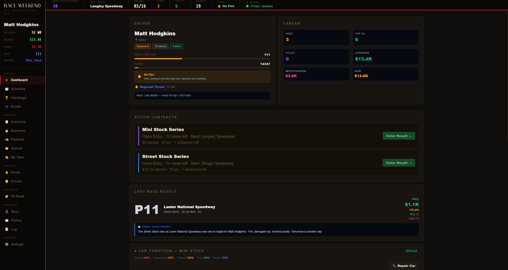
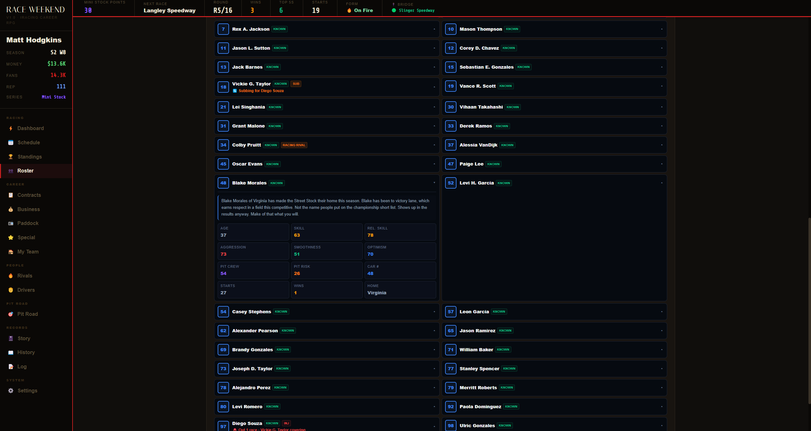
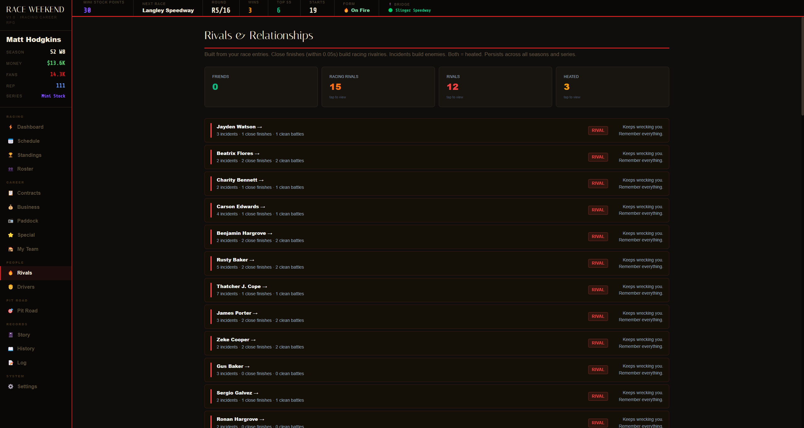

# Race Weekend — iRacing Career RPG

__Screenshots__ • __Download__ • __Report a Bug__ • __Request a Feature__

---

Race in iRacing against AI drivers. Start in Mini Stocks and work your way up through Late Models, Trucks, and Xfinity before reaching Cup.

Race Weekend is a career management app for iRacing's AI racing mode. You race in iRacing, enter your results, and the game tracks everything from rivalries, reputation, contracts, championships, and a world that keeps moving whether you're winning or not.

## Highlights

**Dynamic AI.** Your rivals remember incidents and close finishes. Push the wrong driver too many times and it stops being just between the two of you.

**Fully generated rosters every week.**  Each race gets a unique field with real car numbers and custom liveries. You'll see the same faces week after week, and for big events, drivers from other series show up to fill out the grid.

**A living world.** Everyone on that grid is trying to move up, not just you. If you're not taking the points, someone else is.

**Flag simulation.** Race Weekend runs in the background during your race, throwing caution flags and black flagging both AI drivers and the player for violations and failures that iRacing's AI mode doesn't simulate on its own. Cautions come with a reason: a spin in turn 1, something on the front stretch, a car that stopped where it shouldn't. It's not perfect, but it makes a 100 lap race feel like a 100 lap race. 

## What it looks like

## Getting started

1. Download the latest release from the [Releases](https://github.com/mangobandicoot/Race-Weekend/releases) page
2. Run `RaceWeekend-setup.exe` or use the portable version
3. Enter your name exactly as it appears in iRacing and choose your home region to weigh your schedule toward local tracks
4. Sign a contract and head to the Roster page to export your field for the week
5. In iRacing, create an AI race, import the roster file, and set up your session how you want or following the generated schedule
6. Race, then come back and enter your result

## Requirements

- [iRacing](https://www.iracing.com/) subscription
- Windows 10/11
- Bridge component (included) for flag simulation; can be disabled in settings
- Designed for iRacing's AI offline mode, the bridge connects to your local iRacing instance and works in offline sessions. It may also work in private hosted sessions, though this has not been fully tested.
- Can also be used to track a career in a private league or against friends online by entering results manually.

## Notes

**Privacy.** Race Weekend makes no network calls. Everything runs locally. Your save file stays on your machine, and the only external connection is the bridge talking to iRacing on localhost.

**Built with AI assistance.** The app was conceived and designed by me. Claude (Anthropic) was used extensively during development to help write and debug code.

## Getting involved

🐛 **Found a bug?** Open an issue on GitHub.

💡 **Have an idea?** Feature requests are welcome — open an issue and describe what you're thinking.

## License

MIT License. Do whatever you want with it.